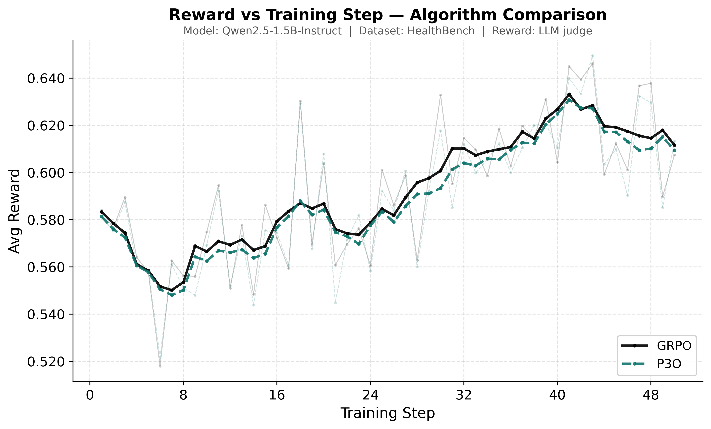

# HealthBench

FeynRL on [HealthBench](https://openai.com/index/healthbench/) — rubric-graded medical-question prompts, LLM-as-judge reward. Model: `Qwen/Qwen2.5-1.5B-Instruct`. Judge: `Qwen/Qwen3-30B-A3B-Instruct-2507`.

## Results

500-prompt held-out test shard, greedy decoding. Avg Reward = mean rubric score.

| Model | Checkpoint | Avg Reward | Pass@1 |
| --- | --- | ---: | ---: |
| Base | — | 0.3919 | 81.0% |
| FeynRL (GRPO) | iter 30 | 0.4275 | 86.0% |
| FeynRL (P3O) | iter 30 | 0.4335 | 86.2% |

GRPO: **+9.1%** avg reward vs base. P3O: **+10.6%**.



## Configs

| | GRPO | P3O | Eval |
| --- | --- | --- | --- |
| Config | [train_grpo.yaml](qwen2.5-1.5b-instruct/train_grpo.yaml) | [train_p3o.yaml](qwen2.5-1.5b-instruct/train_p3o.yaml) | [eval.yaml](qwen2.5-1.5b-instruct/eval.yaml) |

Key settings: 4+4 GPUs · lr 1e-6 · clip 0.2/0.2 · batch 4 · 128 samples/epoch · temp 0.7 · 50 epochs · direct sync.

## Reproduce

```bash
# Training
python main_rl.py --config examples/healthbench/qwen2.5-1.5b-instruct/train_grpo.yaml
python main_rl.py --config examples/healthbench/qwen2.5-1.5b-instruct/train_p3o.yaml

# Evaluation — set model.name to your checkpoint first
python main_eval.py --config examples/healthbench/qwen2.5-1.5b-instruct/eval.yaml
```

Data: `./data/healthbench_v1_train.parquet` and `./data/healthbench_v1_val.parquet` (requires `rubric` column). Set `reward.judge_base_url` to your vLLM endpoint before running.
