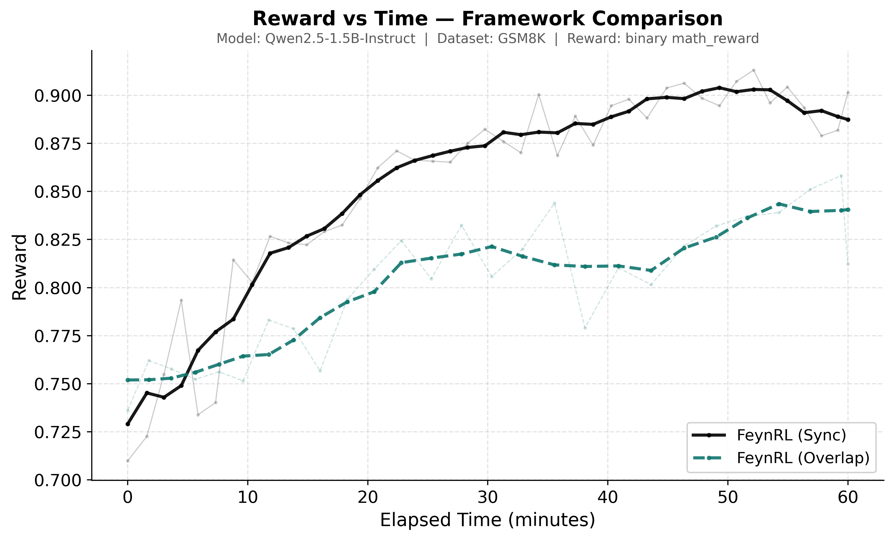
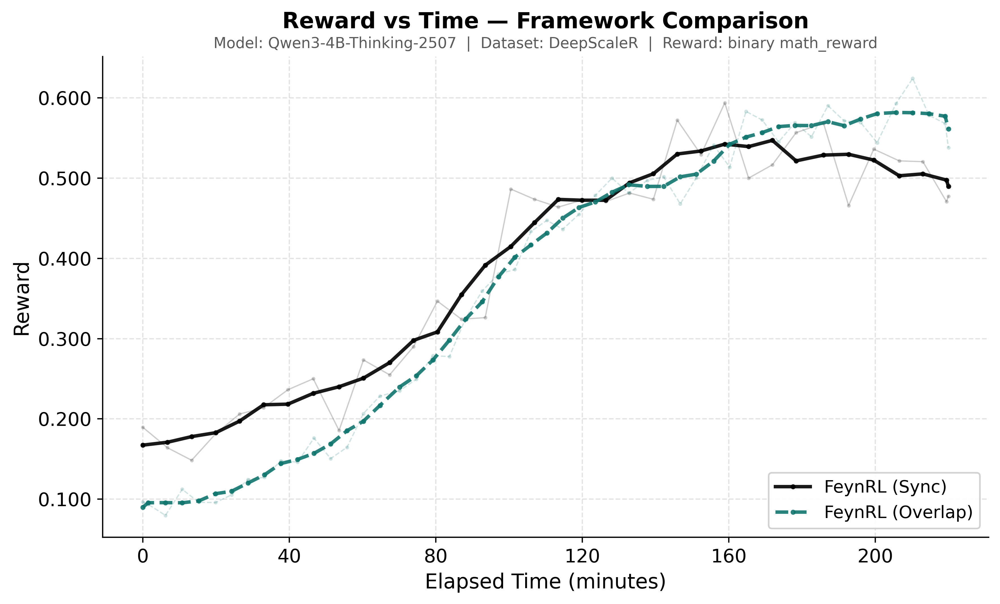

# Math

FeynRL on mathematical reasoning. Algorithm: GRPO. Reward: binary `math_reward`. Hardware: 8×H100, DeepSpeed ZeRO-3 bf16.

## Qwen2.5-1.5B-Instruct

Model: `Qwen/Qwen2.5-1.5B-Instruct` · Dataset: [GSM8K](https://huggingface.co/datasets/openai/gsm8k) · GPU split: 6 training / 2 rollout



### Results

| Model | Avg pass@1 | Avg pass@16 |
| --- | ---: | ---: |
| Base | 12.0% | 26.4% |
| FeynRL | 12.2% | 27.0% |

10 math reasoning benchmarks, 16 samples/prompt, temperature 1.0. Gains vs base: **+0.2 pp** pass@1, **+0.6 pp** pass@16.

### Configs

| Sync | Async | Eval |
| --- | --- | --- |
| [train_sync.yaml](qwen2.5-1.5b-instruct/train_sync.yaml) | [train_async.yaml](qwen2.5-1.5b-instruct/train_async.yaml) | [eval.yaml](qwen2.5-1.5b-instruct/eval.yaml) |

Key settings: lr 1e-5 · clip 0.4/0.4 · batch 8 · 4 samples/prompt · 512 samples/epoch · max tokens 1024 · 100 epochs.

```bash
python main_rl.py --config examples/math/qwen2.5-1.5b-instruct/train_sync.yaml
python main_rl.py --config examples/math/qwen2.5-1.5b-instruct/train_async.yaml
python main_eval.py --config examples/math/qwen2.5-1.5b-instruct/eval.yaml
```

Data prep:
```bash
python data_prep/gsm8k.py --local_dir ./data --run_id 123245 --system_prompt ""
```

---

## Qwen3-4B-Thinking-2507

Model: `Qwen/Qwen3-4B-Thinking-2507` · Dataset: [DeepScaleR](https://huggingface.co/datasets/agentica-org/DeepScaleR-Preview-Dataset) · GPU split: 4 training / 4 rollout



### Results

| Model | Avg pass@1 | Avg pass@16 |
| --- | ---: | ---: |
| Base | 12.2% | 19.7% |
| FeynRL | 27.0% | 40.2% |

Checkpoint `iter000075`, with-system-prompt (`wsp`) evaluation variant. Gains vs base on shared benchmarks: **+12.9 pp** pass@1, **+17.1 pp** pass@16.

### Configs

| Sync | Async | Eval |
| --- | --- | --- |
| [train_sync.yaml](qwen3-4b-thinking-2507/train_sync.yaml) | [train_async.yaml](qwen3-4b-thinking-2507/train_async.yaml) | [eval.yaml](qwen3-4b-thinking-2507/eval.yaml) |

Key settings: lr 1e-5 · clip 0.4/0.4 · batch 4 · GA 2 · 4 samples/prompt · 256 samples/epoch · max tokens 2048 · context 4096 · 500 epochs · NCCL sync.

```bash
python main_rl.py --config examples/math/qwen3-4b-thinking-2507/train_sync.yaml
python main_rl.py --config examples/math/qwen3-4b-thinking-2507/train_async.yaml
python main_eval.py --config examples/math/qwen3-4b-thinking-2507/eval.yaml
```

### Benchmarks

| Benchmark | Dataset |
| --- | --- |
| GSM8K | [openai/gsm8k](https://huggingface.co/datasets/openai/gsm8k) |
| AIME 2024 | [HuggingFaceH4/aime_2024](https://huggingface.co/datasets/HuggingFaceH4/aime_2024) |
| AIME 2025 | [MathArena/aime_2025](https://huggingface.co/datasets/MathArena/aime_2025) |
| AIME 2026 | [MathArena/aime_2026](https://huggingface.co/datasets/MathArena/aime_2026) |
| AMC | [AI-MO/aimo-validation-amc](https://huggingface.co/datasets/AI-MO/aimo-validation-amc) |
| AMO | [meituan-longcat/AMO-Bench](https://huggingface.co/datasets/meituan-longcat/AMO-Bench) |
| Brumo | [MathArena/brumo_2025](https://huggingface.co/datasets/MathArena/brumo_2025) |
| HMMT February | [MathArena/hmmt_feb_2025](https://huggingface.co/datasets/MathArena/hmmt_feb_2025) |
| HMMT November | [MathArena/hmmt_nov_2025](https://huggingface.co/datasets/MathArena/hmmt_nov_2025) |
| Olympiad | [Hothan/OlympiadBench](https://huggingface.co/datasets/Hothan/OlympiadBench) |
