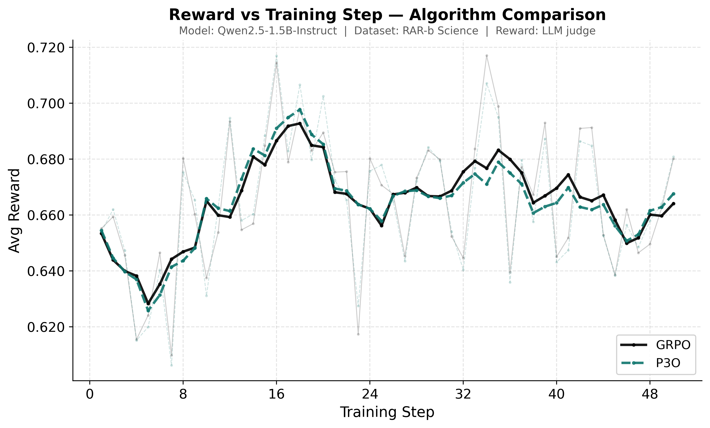

# RAR-b Science

FeynRL on RAR-b Science — rubric-graded science-question benchmark, LLM-as-judge reward. Model: `Qwen/Qwen2.5-1.5B-Instruct`. Judge: `Qwen/Qwen3-30B-A3B-Instruct-2507`.



## Results

Full test shard (2292 prompts), greedy decoding. Avg Reward = mean LLM-judge rubric score.

| Model | Checkpoint | Avg Reward |
| --- | --- | ---: |
| Base | — | 0.4655 |
| FeynRL (GRPO) | iter 50 | 0.5042 |
| FeynRL (P3O) | iter 50 | 0.5030 |

GRPO: +8.3% vs base. P3O: +8.1%.

## Configs

|        | GRPO                                                     | P3O                                                    | Eval                                         |
| ------ | -------------------------------------------------------- | ------------------------------------------------------ | -------------------------------------------- |
| Config | [train_grpo.yaml](qwen2.5-1.5b-instruct/train_grpo.yaml) | [train_p3o.yaml](qwen2.5-1.5b-instruct/train_p3o.yaml) | [eval.yaml](qwen2.5-1.5b-instruct/eval.yaml) |

Key settings: 4+4 GPUs · lr 1e-6 · clip 0.2/0.2 · batch 4 · 128 samples/epoch · temp 0.7 · 50 epochs · direct sync.

## Reproduce

```bash
# Training
python main_rl.py --config examples/rar_science/qwen2.5-1.5b-instruct/train_grpo.yaml
python main_rl.py --config examples/rar_science/qwen2.5-1.5b-instruct/train_p3o.yaml

# Evaluation — set model.name to your checkpoint first
python main_eval.py --config examples/rar_science/qwen2.5-1.5b-instruct/eval.yaml
```

Data: `./data/rar_science_v1_train.parquet` and `./data/rar_science_v1_test.parquet` (requires `rubric` column). Set `reward.judge_base_url` to your vLLM endpoint before running.
